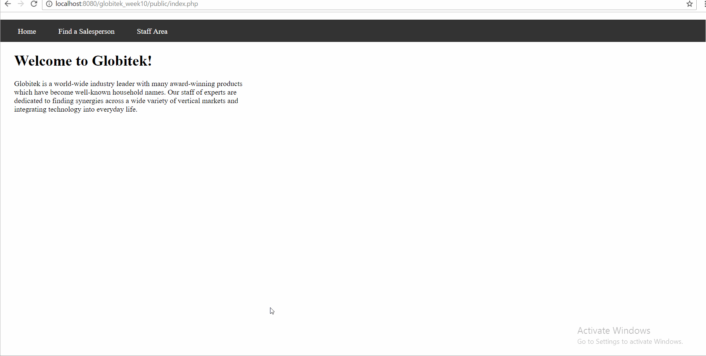

# Project 10 - Fortress Globitek

Time spent: 3 hours spent in total

> Objective: Create an intentionally vulnerable version of the Globitek application with a secret that can be stolen.

### Requirements

- [X] All source code and assets necessary for running app
- [X] `/globitek.sql` containing all required SQL, including the `secrets` table
- [X] GIF Walkthrough of compromise
  
- [X] Brief writeup about the vulnerabilities introduced below

### Vulnerabilities

<b>Vulnerability 1: Insecure Direct Object Reference (IDOR)</b>
  There is an IDOR vulnerability on the globitek/public/salesperson.php page, where an attacker can view the salesperson page with id = 11, which is a restricted admin page with important information about the secret table, by going to globitek/public/salesperson.php?id=11. This information, which is a secret key, can be used to access the secret table when logged in.

<b>Vulnerability 2: Insecure Direct Object Reference (IDOR)</b>
  There is an IDOR vulnerability on the globitek/public/staff/users/new.php page, where an attacker can visit the page, which was originally supposed to be restricted to users not logged in, allowing the attacker to set up their own account and login to the staff page, giving the attacker higher permissions. Once logged in, the attacker can visit the globitek/public/staff/secret/index.php page and enter the recently found key into the form. After submitting the correct key, the secret message from the secret table is revealed to the attacker.
